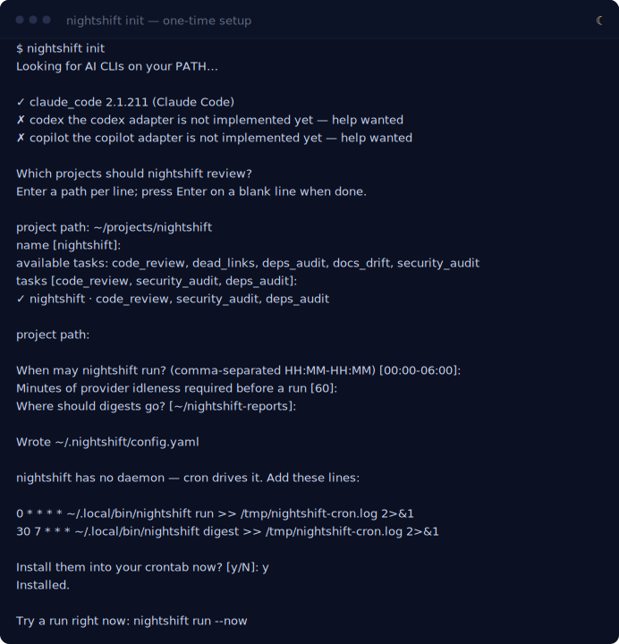
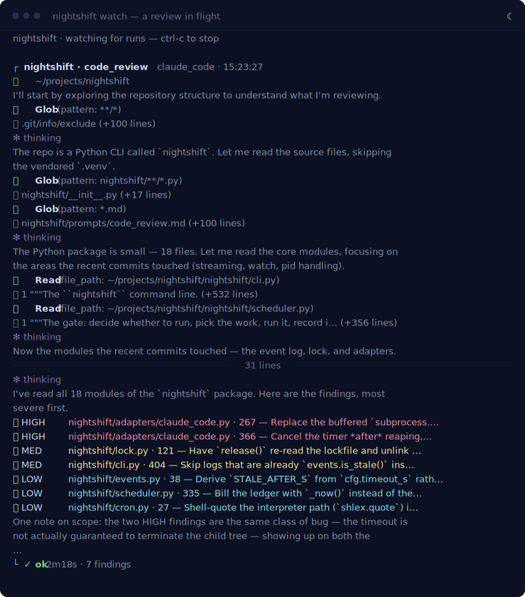
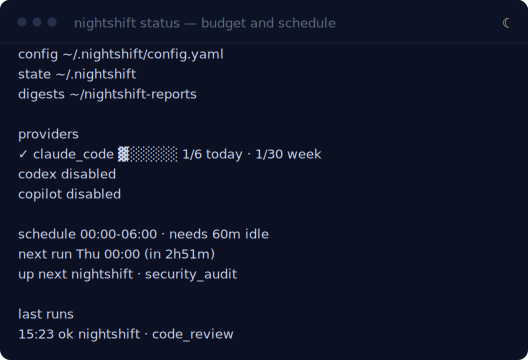

<div align="center">

# nightshift

**Your AI works the night shift.**

Put your idle Claude Code subscription to work — read-only reviews of your
projects while you're busy, one digest every morning.



[](LICENSE)
[](pyproject.toml)

</div>

---

## What this is

You already pay for Claude Code. It sits idle most of the day, and definitely
all night. nightshift spends that idle time reviewing the projects you point it
at, and leaves the results in one Markdown file you read with your coffee.

It never edits your code. It has no daemon and no server — cron calls it, it
decides whether to run, and it goes back to sleep. Everything it knows lives in
two directories you can delete at any time.

That's the whole tool. The rest of this page is how to use it.

## Before you start

- **Python 3.10+**
- **At least one AI CLI**, installed and already logged in — either
  [Claude Code](https://claude.com/claude-code) or
  [Codex](https://developers.openai.com/codex). Run `claude --version` or
  `codex --version`; if that works, nightshift will find it. Have both and it
  will use both, each with its own budget.
- **cron** — standard on macOS and Linux. Windows works via WSL.

You do not need an API key. nightshift drives the same CLIs you use by hand, on
the subscriptions you already have.

## Install it

```bash
pipx install nightshift-cli
```

(`pip install nightshift-cli` works too; pipx just keeps it out of your other
environments. The command is `nightshift` either way.)

## Set it up

Run `nightshift init` once. It finds your AI CLIs, asks which projects to
review and when, writes a config file, and offers to install the cron lines
that drive everything:



The project path is the only thing it needs from you. Everything else has a
working default you can accept with Enter:

| It asks | It means | Default |
| --- | --- | --- |
| **project path** | A repo to review. Enter as many as you like; blank line to finish. | — |
| **name** | What to call it in the digest. | the directory's name |
| **tasks** | Which reviews to run on it. | `code_review, security_audit, deps_audit` |
| **windows** | Hours it's allowed to run, local time. | `00:00-06:00` |
| **idle minutes** | How long you must be away from Claude Code first. | `60` |
| **digest dir** | Where the morning digest lands. | `~/nightshift-reports` |

Everything it writes goes to `~/.nightshift/config.yaml`. Edit it by hand
whenever you like — it's plain YAML, and `nightshift status` validates it.

## See it work

Don't wait until tonight. Force a run right now:

```bash
nightshift run --now
```

`--now` skips the window and idle checks, so you get a review immediately. At a
terminal, nightshift streams it live — you see the same reads and reasoning you
would if you'd run `claude` yourself:



That is a real run of nightshift against its own repository, and those are real
bugs. Two of them became commits the same evening: a run that could hang forever
holding the scheduler's lock (`claude_code.py:366`), and a lock that could be
released by the wrong owner (`lock.py:121`).

Findings are ranked 🔴 HIGH, 🟠 MED, 🟡 LOW, and each one cites a `file:line`
so you can jump straight to it.

## Then forget about it

If you let `init` install the cron lines, you're already done. Cron calls
`nightshift run` every hour; the command decides for itself whether to act and
exits quietly when the answer is no:

```
0 * * * * ~/.local/bin/nightshift run    >> /tmp/nightshift-cron.log 2>&1
30 7 * * * ~/.local/bin/nightshift digest >> /tmp/nightshift-cron.log 2>&1
```

The hourly line is the gated one; the 07:30 line renders yesterday's findings.
`init` writes the absolute path to the binary because cron runs with a minimal
`PATH` that almost certainly doesn't include yours, and redirects both streams
to a log because there is nowhere else for cron's output to go.

A run happens only when **all four gates** open:

1. **Window** — the clock is inside one of your `schedule.windows`.
2. **Idle** — you haven't touched Claude Code for `idle_minutes`. nightshift
   watches `~/.claude/projects` and stays out of your way while you're working.
3. **Budget** — you have runs left today and this week.
4. **Lock** — no other run is already in flight.

Any gate saying no is normal, not an error. It prints one line and exits 0:

```
$ nightshift run
nothing to do — outside configured windows (00:00-06:00)
```

Each run pops one `(project, task)` pair from a persistent round-robin queue,
so every project gets its turn and a noisy one can't starve the rest.

To check on it any time, ask:



And to watch a run that cron started — including one already in progress —
`nightshift watch` follows along live and replays the last finished run first.

## Read the digest

Every run appends to `~/nightshift-reports/YYYY-MM-DD/`. Once a day
`nightshift digest` renders those into one file, `DIGEST-YYYY-MM-DD.md`:

```markdown
# Nightshift · morning digest

Wed Jul 15, 2026 · generated 17:57 local · 1 project · 1 run

## Budget remaining

- `claude_code` ▓░░░░░ 1/6 today · 1/30 week

## Highlights

- 🔴 Replace the buffered `subprocess.run(..., timeout=...)` with the same `Popen` +
  `os.killpg` treatment the streaming path uses … — _nightshift · code_review_ ·
  `nightshift/adapters/claude_code.py:267`
- 🟠 Have `release()` re-read the lockfile and unlink only when the recorded pid is
  still our own … — _nightshift · code_review_ · `nightshift/lock.py:121`

## Run log

| project | task | provider | status | dur | time |
| --- | --- | --- | --- | --- | --- |
| nightshift | code_review | claude_code | ok | 2m18s | 15:23 |
```

Highest severity first, grouped by project, read in twenty seconds.
**[Here is that digest in full](docs/sample-digest.md)** — a real one, not a
mock-up.

Skipped and failed runs stay in the log. A run that didn't happen is
information too, and silently dropping it is how you stop trusting the tool.

Want it early, or for a specific day?

```bash
nightshift digest                    # today, written to the digest dir
nightshift digest --date 2026-07-14  # a past day
nightshift digest --stdout           # print it instead of writing it
```

## 0 files touched

nightshift's entire value depends on being safe to leave unattended, so
read-only isn't a promise in the docs — it's enforced at the layer that
actually executes tools.

The Claude Code adapter invokes the CLI with its own permission flags:

```
claude --print "<prompt>"
  --output-format json
  --allowed-tools     Read Grep Glob NotebookRead
  --disallowed-tools  Bash Edit MultiEdit Write NotebookEdit WebFetch WebSearch Task
```

Three things are true because of that:

- **The allowlist is the whole tool budget.** Claude Code cannot call a tool
  that isn't on it. There is no Edit, no Write, no shell.
- **The denylist is belt-and-braces.** It exists so that a future CLI release
  adding a new write-capable tool to the defaults can't silently widen what
  nightshift can do.
- **No fallback.** If the flags are rejected, the run fails and is logged as
  failed. nightshift never retries an unrestricted invocation.

The prompts reinforce it, but prompts are not a security boundary and aren't
treated as one. The flags are.

nightshift also never touches your git state: no commits, no branches, no
pushes. It reads, and it writes exactly one place — the digest directory.

## Don't let it burn your quota

nightshift runs on the subscription you already pay for, which means the
fastest way for it to become a problem is to burn through your quota. So it
counts.

```yaml
providers:
  claude_code:
    enabled: true
    budget:
      max_runs_per_day: 6
      max_runs_per_week: 30
```

- **Every attempt counts** — including failures and timeouts. They spent your
  quota, so they cost budget. Counting only successes would let a broken
  project drain the account in a loop.
- **Both caps bind.** Under the daily cap but at the weekly one? It stops.
- **`--now` skips the window and idle checks, never the budget check.**
- **At the cap it stops and says so**, once, as a `skipped` row in the digest.

Start low. Six runs a day is already a lot of review.

## Configuration

Lives at `~/.nightshift/config.yaml`. Here it is in full — this is every knob
there is:

```yaml
providers:
  claude_code:
    enabled: true
    budget: { max_runs_per_day: 6, max_runs_per_week: 30 }
  codex:
    enabled: true
    budget: { max_runs_per_day: 6, max_runs_per_week: 30 }
    # Optional. Only needed when the CLI isn't on PATH under its own name —
    # e.g. the Codex bundled inside ChatGPT.app:
    binary: /Applications/ChatGPT.app/Contents/Resources/codex

projects:
  - name: gradagent
    path: ~/projects/gradagent
    tasks: [code_review, deps_audit, docs_drift]
  - name: nightshift
    path: ~/projects/nightshift
    tasks: [code_review]
    # Optional. Pin this project to one provider. Without it, whichever enabled
    # provider is idle and under budget takes the project.
    provider: codex

schedule:
  windows: ["09:00-18:00", "00:00-06:00"]   # local time; may cross midnight
  idle_minutes: 60

digest:
  dir: ~/nightshift-reports
run:
  timeout_s: 600
```

Run `nightshift status` after editing — it validates the file and tells you
exactly what's wrong if anything is.

Set `NIGHTSHIFT_HOME` to move the whole state directory somewhere else.

## Tasks

A task is just a prompt template. Five ship with nightshift:

| task | what it looks for |
| --- | --- |
| `code_review` | Bugs, races, and correctness problems |
| `security_audit` | Injection, authz gaps, unsafe defaults |
| `deps_audit` | Unpinned, stale, or risky dependencies |
| `docs_drift` | Docs that no longer match the code |
| `dead_links` | Links and image paths pointing at things that aren't there |

Give each project the tasks that suit it — a Terraform repo probably wants
`security_audit` and `deps_audit`, not `dead_links`.

**Write your own:** drop any `.md` file into `~/.nightshift/prompts/` and its
filename becomes a valid task name. Use a shipped name to override that
template.

Templates must tell the model to prefix each finding with `HIGH`, `MED`, or
`LOW` and cite a `file:line`. Parsing is lenient — an unlabelled finding is
kept and filed as `LOW` rather than dropped.

## Commands

| command | what it does |
| --- | --- |
| `nightshift init` | Detect CLIs, register projects, write config, offer to install cron |
| `nightshift run [--now]` | One gated run. `--now` skips window+idle checks |
| `nightshift watch [-n N]` | Follow runs live, including ones cron started |
| `nightshift digest [--date]` | Render `DIGEST-YYYY-MM-DD.md` |
| `nightshift status` | Budget bars, recent runs, next window, provider health |

Each takes `--help`.

## Troubleshooting

**`nothing to do — outside configured windows (00:00-06:00)`**
Working as designed — it's not in a window. Use `nightshift run --now` to run
anyway, or widen `schedule.windows`.

**`nothing to do — claude_code used 12m ago (needs 60m idle)`**
You've been using Claude Code, so nightshift is staying out of your way. Use
`--now`, or lower `idle_minutes` (`0` disables the check).

**`nothing to do — claude_code: daily budget spent (6/6 today)`**
Out of quota for today. Raise `max_runs_per_day` if you want more.

**``No usable AI CLI found. Install Claude Code or Codex and re-run `nightshift init`.``**
Neither CLI is on your `PATH`. Check `claude --version` / `codex --version` in
the same shell.

**Cron never runs it.** Cron uses a minimal `PATH`, which is why `init` writes
the absolute path to the binary into your crontab. Check
`/tmp/nightshift-cron.log` — everything cron runs is logged there. On macOS,
cron may also need Full Disk Access to read your projects.

**A run is stuck.** Runs are killed at `run.timeout_s` (default 600s) and
recorded as `timeout`. There is nothing to clean up by hand.

## Uninstall

nightshift keeps no state anywhere else, so removing it is three lines:

```bash
crontab -e                    # delete the block (see below)
rm -rf ~/.nightshift          # config, ledger, queue, event logs
pipx uninstall nightshift-cli
```

`init` fences its crontab lines between two markers — delete them and
everything between:

```
# nightshift (managed — edit via `nightshift init`)
...
# end nightshift
```

Your digests in `~/nightshift-reports` are yours — delete them or don't.

## Providers

The scheduler, ledger, queue, and digest are all provider-agnostic. Enable
whichever CLIs you have; each gets its own budget.

| provider | status | how read-only is enforced |
| --- | --- | --- |
| `claude_code` | working | CLI permission flags — an allowlist of read-class tools, plus a denylist of every mutating one |
| `codex` | working | Codex's own OS sandbox — Seatbelt on macOS, Landlock + seccomp on Linux |
| `copilot` | stub | — see below |

One hard requirement, and it's the whole reason that last column exists: **the
read-only guarantee must be enforced by the CLI's own permission system**, not
by asking the model nicely. An adapter that can't do that won't be merged,
because "0 files touched" is the whole product.

**Copilot: help wanted, but blocked upstream.** It ships as a documented stub
(`nightshift/adapters/copilot.py`). The obstacle isn't effort — it's that
Copilot CLI has no enforcement primitive that clears the bar. Its file-level
denials don't apply across tools, so `shell(cat x)` walks around a denied
`read(x)`, and [an open issue](https://github.com/github/copilot-cli/issues/2722)
reports `--deny-tool="read(...)"` blocking *all* reads regardless of pattern.
Denials one tool honors and another ignores aren't a permission system. If that
changes upstream, the adapter is an afternoon's work — `codex.py` and
`claude_code.py` are both reference shapes.

## Development

```bash
python -m venv .venv && .venv/bin/pip install -e ".[dev]"
.venv/bin/pytest
```

The test suite spends zero quota: the scheduler, budget, queue, and digest are
covered against a `FakeAdapter`, and the Claude Code adapter is tested with a
mocked `subprocess`. No test ever shells out to a real AI CLI.

The images on this page are generated from real captured output — see
[docs/RECORDING.md](docs/RECORDING.md) if you change what the CLI prints.

## License

MIT
